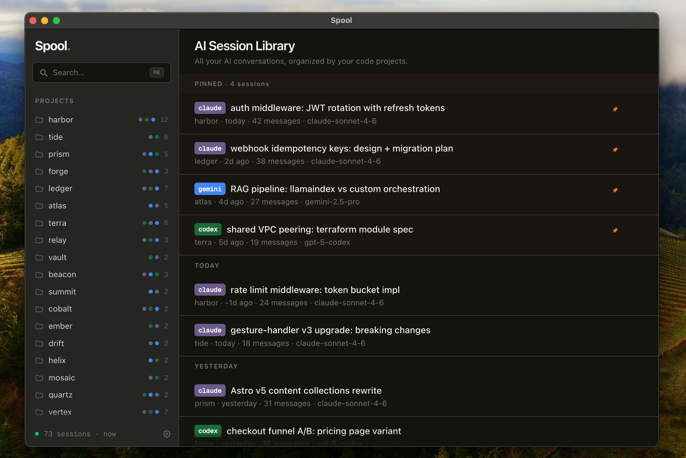

# Spool

The missing search engine for your own data.

<p align="center">
  
</p>

Search your Claude Code sessions, Codex CLI history, Gemini CLI chats, GitHub stars, Twitter bookmarks, and YouTube likes — locally, instantly.

> **Early stage.** Spool is under active development — expect rough edges. Feedback, bug reports, and ideas are very welcome via [Issues](https://github.com/spool-lab/spool/issues) or [Discord](https://discord.gg/aqeDxQUs5E).

## Install

```bash
curl -fsSL https://spool.pro/install.sh | bash
```

macOS / Apple Silicon only. Or build from source:

```bash
pnpm install
pnpm build
# DMG is in packages/app/dist/
```

## What it does

Spool indexes your AI conversations and bookmarks into a single local search box.

- **AI sessions** — watches Claude/Codex/Gemini session dirs in real time, including profile-based paths like `~/.claude-profiles/*/projects`, `~/.codex-profiles/*/sessions`, and Gemini’s project temp dirs under `~/.gemini/tmp/*/chats`
- **Connectors** — sync bookmarks and stars from platforms like Twitter/X, GitHub, and more via installable connector plugins
- **Agent search** — a `/spool` skill inside Claude Code feeds matching fragments back into your conversation

Everything stays on your machine. Nothing leaves.

## Architecture

```
packages/
  app/      Electron macOS app (React + Vite + Tailwind)
  core/     Indexing engine (SQLite + FTS5)
  cli/      CLI interface (`spool search ...`)
  landing/  spool.pro website
```

## Development

```bash
pnpm install
pnpm exec electron-rebuild -f -w better-sqlite3   # rebuild native modules for Electron
pnpm dev          # starts app + landing in dev mode
pnpm test         # runs all tests
```

> **Note:** The `electron-rebuild` step is required whenever you run `pnpm install` or switch Node.js versions. Without it, the Electron app will crash at launch with a `NODE_MODULE_VERSION` mismatch error from `better-sqlite3`.

If you switch between **Node-side tests** and **Electron app/e2e runs**, rebuild `better-sqlite3` for the matching runtime:

```bash
pnpm run rebuild:native:node      # before @spool/core / Node-based tests
pnpm run rebuild:native:electron  # before launching the Electron app or e2e tests
```

## Release

```bash
./scripts/release.sh        # bump version, build, create GitHub release
```

## Acknowledgements

- **[fieldtheory-cli](https://github.com/afar1/fieldtheory-cli)** — Twitter/X bookmark sync implementation adapted from this project

## License

MIT
